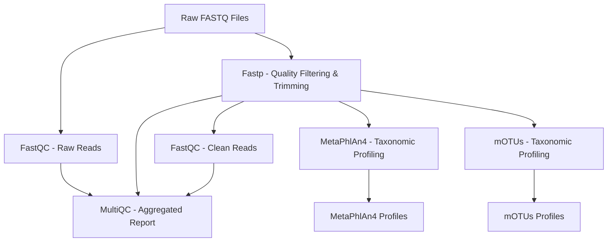

# Metagenomic Profiling Pipeline Documentation

## Overview

This Nextflow pipeline performs comprehensive metagenomic profiling of paired-end whole genome sequencing (WGS) data. The pipeline integrates quality control, read preprocessing, and taxonomic profiling using two complementary tools (MetaPhlAn4 and mOTUs) to provide robust microbial community characterization.

**Pipeline Version:** 1.0.0  
**Author:** Alise Ponsero  
**Nextflow Version Required:** ≥22.10.0

---

## Workflow Description

The pipeline implements the following workflow:



### Workflow Steps

1. **Quality Control (Raw Reads)**
   - Tool: FastQC v0.12.1
   - Assesses raw read quality metrics
   - Output: HTML reports and quality metrics

2. **Read Preprocessing**
   - Tool: Fastp v0.23.4
   - Performs adapter trimming, quality filtering, and length filtering
   - Generates JSON and HTML reports with filtering statistics
   - Highly configurable with extensive quality control parameters

3. **Quality Control (Clean Reads)**
   - Tool: FastQC v0.12.1
   - Validates quality improvement after preprocessing
   - Output: HTML reports and quality metrics

4. **Taxonomic Profiling - MetaPhlAn4**
   - Tool: MetaPhlAn v4.2.4
   - Performs marker gene-based taxonomic profiling
   - Uses species-specific marker genes from the MetaPhlAn database
   - Provides relative abundance estimates at multiple taxonomic levels
   - Runs in parallel with mOTUs

5. **Taxonomic Profiling - mOTUs**
   - Tool: mOTUs v4.0.4
   - Performs marker gene-based taxonomic profiling using universal single-copy marker genes
   - Complementary approach to MetaPhlAn4
   - Runs in parallel with MetaPhlAn4

6. **Quality Report Aggregation**
   - Tool: MultiQC v1.21
   - Aggregates QC metrics from FastQC and Fastp
   - Generates comprehensive HTML report

---

## Tools and Versions

| Tool | Version | Container Source | Purpose |
|------|---------|------------------|---------|
| **FastQC** | 0.12.1 | quay.io/biocontainers/fastqc:0.12.1--hdfd78af_0 | Quality control assessment |
| **Fastp** | 0.23.4 | quay.io/biocontainers/fastp:0.23.4--hadf994f_3 | Read trimming and filtering |
| **MetaPhlAn** | 4.2.4 | quay.io/biocontainers/metaphlan:4.2.4--pyhdfd78af_0 | Taxonomic profiling |
| **mOTUs** | 4.0.4 | library://aponsero/infogut/motus:4.0.4 | Taxonomic profiling |
| **MultiQC** | 1.21 | quay.io/biocontainers/multiqc:1.21--pyhdfd78af_0 | Report aggregation |

### Container Technology

The pipeline uses **Singularity** containers for reproducibility and portability. All containers are automatically pulled and cached in the directory specified by `singularity_cache_dir`.

---

## Installation

### Prerequisites

The pipeline uses Nextflow ≥22.10.0 and Singularity which is assumed to be pre-installed by the user.

### Quick Setup (Recommended)

The pipeline includes an automated setup script that downloads all required databases and containers.

**Run the setup script:**

```bash
# Interactive mode (will prompt for installation directory)
./setup_pipeline.sh

# Or specify directory directly
./setup_pipeline.sh /shared/pipeline_resources
```

**What the script does:**

1. Creates directory structure:
   - `databases/motus/` - mOTUs database (~7 GB)
   - `databases/metaphlan4/` - MetaPhlAn4 database (~35 GB)
   - `singularity_cache/` - Container images (~3 GB)
   - `logs/` - Setup logs

2. Downloads mOTUs database from Zenodo

3. Pulls all required Singularity containers:
   - FastQC v0.12.1
   - Fastp v0.23.4
   - MetaPhlAn v4.2.4
   - mOTUs v4.0.4
   - MultiQC v1.21

4. Downloads and installs MetaPhlAn4 database

5. Generates a configuration file (`pipeline_paths.config`) with all paths

**After setup completes:**

```bash
# Run the pipeline - database paths are already configured!
nextflow run main.nf \
  --input samples.csv \
  --outdir results

# Or use the generated config for explicit paths
nextflow run main.nf \
  -c /path/to/pipeline_paths.config \
  --input samples.csv \
  --outdir results
```

> [!NOTE]
> After running the setup script, the default database paths in `nextflow.config` point to `./databases/motus/db_mOTU` and `./databases/metaphlan4/metaphlan_db`. If you installed to a different location, either use the generated `pipeline_paths.config` file or specify paths via command-line parameters.

### Manual Installation

If you prefer manual setup or need to customize the installation:

**1. Create directory structure:**
```bash
mkdir -p pipeline_resources/{databases/{motus,metaphlan4},singularity_cache}
```

**2. Download mOTUs database:**
```bash
cd pipeline_resources/databases/motus
wget https://zenodo.org/records/17668622/files/db_mOTU.tar.gz
tar -xzvf db_mOTU.tar.gz
touch db_mOTU/db_mOTU.downloaded
rm db_mOTU.tar.gz  # Optional: save space
```

**3. Download containers:**
```bash
cd ../../singularity_cache

singularity pull --name quay.io-biocontainers-fastqc-0.12.1--hdfd78af_0.img \
  docker://quay.io/biocontainers/fastqc:0.12.1--hdfd78af_0

singularity pull --name quay.io-biocontainers-fastp-0.23.4--hadf994f_3.img \
  docker://quay.io/biocontainers/fastp:0.23.4--hadf994f_3

singularity pull --name quay.io-biocontainers-metaphlan-4.2.4--pyhdfd78af_0.img \
  docker://quay.io/biocontainers/metaphlan:4.2.4--pyhdfd78af_0

singularity pull --name aponsero-infogut-motus-4.0.4.img --arch amd64 \
  library://aponsero/infogut/motus:4.0.4

singularity pull --name quay.io-biocontainers-multiqc-1.21--pyhdfd78af_0.img \
  docker://quay.io/biocontainers/multiqc:1.21--pyhdfd78af_0
```

**4. Download MetaPhlAn4 database:**
```bash
cd ../databases/metaphlan4
mkdir -p metaphlan_db

singularity exec ../../singularity_cache/quay.io-biocontainers-metaphlan-4.2.4--pyhdfd78af_0.img \
  metaphlan --install --index latest --db_dir metaphlan_db
```

**5. Configure pipeline:**

Edit `nextflow.config` or create a custom config file with your paths:
```groovy
params {
    singularity_cache_dir = '/path/to/pipeline_resources/singularity_cache'
    database_cache_dir    = '/path/to/pipeline_resources/databases'
    metaphlan_db          = '/path/to/pipeline_resources/databases/metaphlan4/metaphlan_db'
    motus_db_host         = '/path/to/pipeline_resources/databases/motus/db_mOTU'
}
```

### Disk Space Requirements

Ensure sufficient disk space before installation:

| Component | Size | Description |
|-----------|------|-------------|
| mOTUs database | ~7 GB | Compressed: ~10 GB, Extracted: ~7 GB |
| MetaPhlAn4 database | ~35 GB | Downloaded and indexed |
| Singularity containers | ~3 GB | All 5 container images |
| **Total** | **~45 GB** | Minimum required space |

---

## mOTUs Database Workaround

### The Challenge

mOTUs has a **hardcoded database path** within its installation directory and does not support custom database locations. When using containerized environments (Singularity/Docker), this creates a challenge because:

1. The mOTUs tool expects the database at: `/opt/conda/envs/motus4/lib/python3.12/site-packages/motus/db_mOTU`
2. We want to store the database on the host system to avoid downloading it into every container
3. The database is large (~7 GB) and should be shared across pipeline runs

### The Solution: Manual Singularity Execution with Bind Mounting

This pipeline implements a **manual singularity execution workaround** to handle mOTUs' database requirements and avoid Singularity overlay warnings.

**How it works:**

1. **Download the database** to a persistent location on your host system in: /path/to/databases/motus/db_mOTU/

2. **Configure the pipeline** with three required paths in your run command or config:
   ```bash
   nextflow run main.nf \
       --motus_db_host /path/to/databases/motus/db_mOTU \
       --motus_container /path/to/singularity_cache/aponsero-infogut-motus-4.0.4.img \
       --singularity_cache_dir /path/to/singularity_cache
   ```

3. **Manual singularity execution** - The mOTUs module bypasses Nextflow's container management and directly calls singularity with the `--silent` flag:
   ```nextflow
   singularity --silent exec \
       --bind ${params.motus_db_host}:/opt/conda/envs/motus4/lib/python3.12/site-packages/motus/db_mOTU \
       ${params.motus_container} \
       motus profile ...
   ```

4. **Benefits:**
   - `--silent` flag suppresses Singularity overlay warnings
   - Direct bind mounting avoids Nextflow containerOptions issues
   - mOTUs finds its database at the expected internal path
   - Database remains on the host system for easy updates

**Note:** This approach is specific to mOTUs. All other tools (FastQC, Fastp, MetaPhlAn4, MultiQC, ...) use standard Nextflow container management.

### Important Considerations

> [!WARNING]
> The bind mount path is **version-specific**. If you update the mOTUs container version, you may need to update the internal path in `nextflow.config`.

**Current container:** `library://aponsero/infogut/motus:4.0.4`  
**Internal path:** `/opt/conda/envs/motus4/lib/python3.12/site-packages/motus/db_mOTU`

If using a different mOTUs version, verify the correct internal path:
```bash
# Check the mOTUs installation path in your container
singularity exec motus_container.sif which motus
singularity exec motus_container.sif python -c "import motus; print(motus.__file__)"
```

### Database Download Instructions

The database must be downloaded using mOTUs itself. You have two options:

**Option 1: Download using the container**
```bash
# Create database directory
mkdir -p /shared/databases/motus

# Download database using the pipeline's container
singularity exec library://aponsero/infogut/motus:4.0.4 \
    motus downloadDB -o /shared/databases/motus
```

**Option 2: Download from Zenodo directly**
```bash
wget -c https://zenodo.org/records/17668622/files/db_mOTU.tar.gz \
        -O db_mOTU.tar.gz
```

---

## Input Requirements

### Samplesheet Format

The pipeline requires a CSV samplesheet with the following columns:

| Column | Description |
|--------|-------------|
| `sample` | Unique sample identifier |
| `read1` | Absolute or relative path to R1 FASTQ file (can be gzipped) |
| `read2` | Absolute or relative path to R2 FASTQ file (can be gzipped) |

**Example samplesheet (`samplesheet.csv`):**
```csv
sample,read1,read2
sample1,/path/to/sample1_R1.fastq.gz,/path/to/sample1_R2.fastq.gz
sample2,/path/to/sample2_R1.fastq.gz,/path/to/sample2_R2.fastq.gz
sample3,/path/to/sample3_R1.fastq.gz,/path/to/sample3_R2.fastq.gz
```

> [!NOTE]
> - Sample names must be unique
> - File paths can be absolute or relative to the working directory
> - FASTQ files can be compressed (.gz) or uncompressed

---

## Running the Pipeline

### Basic Usage

**If you used the setup script (databases in default locations):**

```bash
nextflow run main.nf \
  --input samplesheet.csv \
  --outdir results
```

**If databases are in custom locations:**

```bash
nextflow run main.nf \
  --input samplesheet.csv \
  --outdir results \
  --motus_db_host /path/to/motus/database \
  --metaphlan_db /path/to/metaphlan/database
```

### Using Execution Profiles

The pipeline includes several pre-configured profiles:

#### Standard Profile (Default)
```bash
nextflow run main.nf \
  --input samplesheet.csv \
  --outdir results \
  --motus_db_host /path/to/motus/database \
  -profile standard
```

#### SLURM Profile
```bash
nextflow run main.nf \
  --input samplesheet.csv \
  --outdir results \
  --motus_db_host /path/to/motus/database \
  -profile slurm
```

#### Quadram Institute Profile
```bash
nextflow run main.nf \
  --input samplesheet.csv \
  --outdir results \
  --motus_db_host /path/to/motus/database \
  -profile quadram
```

---

## Configuration Parameters

### Essential Parameters

These parameters **must** be specified:

```groovy
params {
    input = null    // Path to samplesheet CSV (REQUIRED)
    outdir = './results'  // Output directory
}
```

**Database paths (have defaults, override if needed):**

```groovy
params {
    motus_db_host = './databases/motus/db_mOTU'  // Default matches setup script
    metaphlan_db  = './databases/metaphlan4/metaphlan_db'  // Default matches setup script
}
```

### Cache Directories

Configure persistent storage for databases and containers:

```groovy
params {
    singularity_cache_dir = './singularity_cache'  // Container cache
    database_cache_dir    = './databases'          // Database cache
}
```

### Fastp Parameters

#### Quality Filtering
```groovy
params {
    fastp_qualified_quality_phred   = 15    // Minimum base quality (Q15)
    fastp_unqualified_percent_limit = 40    // Max % of unqualified bases allowed
    fastp_n_base_limit              = 5     // Max N bases allowed per read
    fastp_average_qual              = 0     // Average quality threshold (0 = disabled)
}
```

#### Length Filtering
```groovy
params {
    fastp_length_required = 15    // Minimum read length after trimming
    fastp_length_limit    = 0     // Maximum read length (0 = no limit)
}
```

#### Adapter Trimming
```groovy
params {
    fastp_detect_adapter_for_pe = true   // Auto-detect PE adapters
    fastp_adapter_sequence      = null   // Manual R1 adapter (null = auto)
    fastp_adapter_sequence_r2   = null   // Manual R2 adapter (null = auto)
}
```

#### Fixed Trimming
```groovy
params {
    fastp_trim_front1 = 0    // Trim N bases from R1 5' end
    fastp_trim_tail1  = 0    // Trim N bases from R1 3' end
    fastp_trim_front2 = 0    // Trim N bases from R2 5' end
    fastp_trim_tail2  = 0    // Trim N bases from R2 3' end
}
```

#### Sliding Window Quality Trimming
```groovy
params {
    fastp_cut_front       = false  // Enable 5' to 3' sliding window
    fastp_cut_tail        = false  // Enable 3' to 5' sliding window
    fastp_cut_right       = false  // Enable aggressive 5' to 3' trimming
    fastp_cut_window_size = 4      // Window size
    fastp_cut_mean_quality = 20    // Mean quality threshold (Q20)
}
```

#### PolyG/PolyX Trimming
```groovy
params {
    fastp_trim_poly_g         = false  // Force polyG trimming
    fastp_disable_trim_poly_g = false  // Disable auto polyG trimming
    fastp_trim_poly_x         = false  // Enable polyX trimming
}
```

#### Advanced Options
```groovy
params {
    fastp_dedup                 = false  // Enable deduplication
    fastp_low_complexity_filter = false  // Enable complexity filter
    fastp_complexity_threshold  = 30     // Complexity threshold (30%)
    fastp_correction            = false  // Enable base correction
    fastp_compression           = 4      // Compression level (1-9)
    fastp_extra_args            = ''     // Additional arguments
}
```

### MetaPhlAn4 Parameters

#### Database Configuration
```groovy
params {
    metaphlan_db  = './databases/metaphlan4/metaphlan_db'  // Default matches setup script
    metaphlan_index   = 'latest'  // Database version
    metaphlan_offline = false     // Don't check for updates
}
```

#### Mapping Parameters
```groovy
params {
    metaphlan_bt2_ps       = 'very-sensitive'  // Bowtie2 preset
    metaphlan_min_mapq_val = 5                 // Minimum MAPQ
    metaphlan_read_min_len = 70                // Minimum read length
    metaphlan_save_mapout  = false             // Save mapping output
}
```

**Bowtie2 Preset Options:**
- `sensitive` - Fast, less sensitive
- `very-sensitive` - Slower, more sensitive (default)
- `sensitive-local` - Local alignment, fast
- `very-sensitive-local` - Local alignment, sensitive

#### Taxonomic Configuration
```groovy
params {
    metaphlan_tax_level = 'a'  // Taxonomic level to report
}
```

**Taxonomic Level Options:**
- `a` - All levels (default)
- `k` - Kingdom
- `p` - Phylum
- `c` - Class
- `o` - Order
- `f` - Family
- `g` - Genus
- `s` - Species
- `t` - Strain/SGB

#### Taxonomic Filtering
```groovy
params {
    metaphlan_ignore_eukaryotes = false  // Exclude eukaryotes
    metaphlan_ignore_bacteria   = false  // Exclude bacteria
    metaphlan_ignore_archaea    = false  // Exclude archaea
}
```

#### Statistical Parameters
```groovy
params {
    metaphlan_min_alignment_len = null     // Min alignment length (null = auto)
    metaphlan_stat_q            = 0.2      // Quantile for robust average
    metaphlan_perc_nonzero      = 0.33     // % markers for species ID
    metaphlan_stat              = 'tavg_g' // Statistical method
}
```

**Statistical Method Options:**
- `avg_g` - Average genome
- `avg_l` - Average length
- `tavg_g` - Truncated average genome (default)
- `tavg_l` - Truncated average length
- `wavg_g` - Weighted average genome
- `wavg_l` - Weighted average length
- `med` - Median

#### Analysis Type
```groovy
params {
    metaphlan_analysis_type = 'rel_ab_w_read_stats'  // Output type
}
```

**Analysis Type Options:**
- `rel_ab` - Relative abundance only
- `rel_ab_w_read_stats` - Relative abundance with read statistics (default)
- `clade_profiles` - Clade-specific profiles
- `marker_ab_table` - Marker abundance table
- `marker_pres_table` - Marker presence table

#### Advanced Options
```groovy
params {
    metaphlan_ignore_markers = null   // File with markers to ignore
    metaphlan_verbose        = false  // Verbose output
    metaphlan_extra_args     = ''     // Additional arguments
}
```

### mOTUs Parameters

```groovy
params {
    motus_db_host = './databases/motus/db_mOTU'  // Default matches setup script
    motus_marker_gene_cutoff = 3                 // Marker gene cutoff (1-10)
    motus_min_length         = 75                // Min alignment length (bp)
    motus_counting_mode      = 'INSERT_SCALED'   // Counting mode
    motus_extra_args         = ''                // Additional arguments
}
```

**Marker Gene Cutoff:**
- `1` - Higher recall, lower precision
- `3` - Balanced (default)
- `6` - Higher precision, lower recall
- `10` - Maximum precision

**Counting Mode Options:**
- `INSERT_RAW` - Raw insert counts
- `INSERT_NORM` - Normalized insert counts
- `INSERT_SCALED` - Scaled insert counts (default)
- `BASE_RAW` - Raw base counts
- `BASE_NORM` - Normalized base counts

### MultiQC Parameters

```groovy
params {
    multiqc_config     = null                           // Custom config file
    multiqc_title      = 'Metagenomic Profiling Report' // Report title
    multiqc_extra_args = ''                             // Additional arguments
}
```
---

## Output Structure

The pipeline generates the following output directory structure:

```
results/
├── 01_fastqc_raw/
│   ├── sample1_R1_fastqc.html
│   ├── sample1_R1_fastqc.zip
│   ├── sample1_R2_fastqc.html
│   └── sample1_R2_fastqc.zip
├── 02_fastp/
│   ├── sample1_R1.trimmed.fastq.gz
│   ├── sample1_R2.trimmed.fastq.gz
│   ├── sample1.fastp.json
│   └── sample1.fastp.html
├── 03_fastqc_clean/
│   ├── sample1_R1.trimmed_fastqc.html
│   ├── sample1_R1.trimmed_fastqc.zip
│   ├── sample1_R2.trimmed_fastqc.html
│   └── sample1_R2.trimmed_fastqc.zip
├── 04_metaphlan4/
│   ├── sample1_profile.txt
│   └── sample1.mapout.bz2 (optional)
├── 05_motus/
│   ├── sample1_motus_profile.txt
│   └── sample1_motus.log
├── 06_multiqc/
│   ├── multiqc_report.html
│   └── multiqc_report_data/
└── pipeline_info/
    ├── timeline.html
    ├── report.html
    ├── trace.txt
    └── dag.svg
```

### Output Descriptions

| Directory | Contents | Description |
|-----------|----------|-------------|
| `01_fastqc_raw/` | FastQC reports | Quality metrics for raw reads |
| `02_fastp/` | Trimmed reads + reports | Cleaned FASTQ files and filtering statistics |
| `03_fastqc_clean/` | FastQC reports | Quality metrics for cleaned reads |
| `04_metaphlan4/` | Taxonomic profiles | MetaPhlAn4 relative abundance tables |
| `05_motus/` | Taxonomic profiles | mOTUs relative abundance tables |
| `06_multiqc/` | Aggregated report | Combined QC metrics from all samples |
| `pipeline_info/` | Execution reports | Pipeline execution statistics and DAG |

---

## Citations

If you use this pipeline, please cite:

- **Nextflow:** Di Tommaso, P., et al. (2017). Nextflow enables reproducible computational workflows. Nature Biotechnology, 35(4), 316-319.
- **FastQC:** Andrews, S. (2010). FastQC: A Quality Control Tool for High Throughput Sequence Data.
- **Fastp:** Chen, S., et al. (2018). fastp: an ultra-fast all-in-one FASTQ preprocessor. Bioinformatics, 34(17), i884-i890.
- **MetaPhlAn4:** Blanco-Míguez, A., et al. (2023). Extending and improving metagenomic taxonomic profiling with uncharacterized species using MetaPhlAn 4. Nature Biotechnology, 41, 1633-1644.
- **mOTUs:** Ruscheweyh, H.J., et al. (2022). Cultivation-independent genomes greatly expand taxonomic-profiling capabilities of mOTUs across various environments. Microbiome, 10, 212.
- **MultiQC:** Ewels, P., et al. (2016). MultiQC: summarize analysis results for multiple tools and samples in a single report. Bioinformatics, 32(19), 3047-3048.

